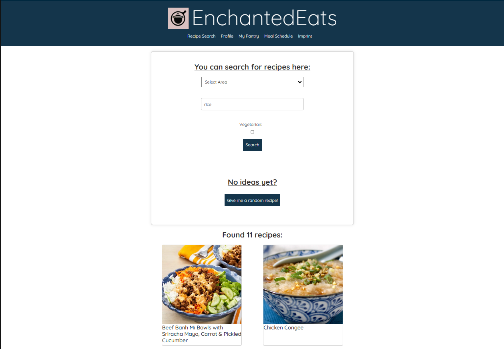
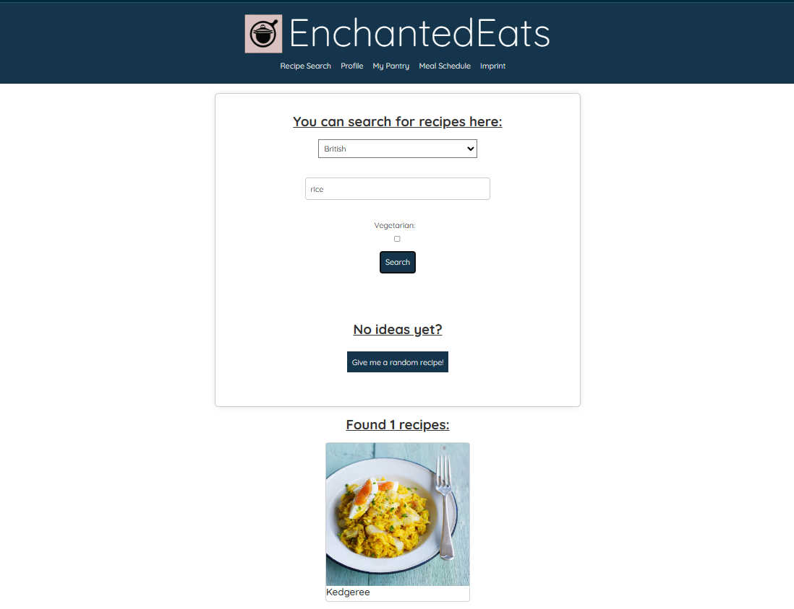
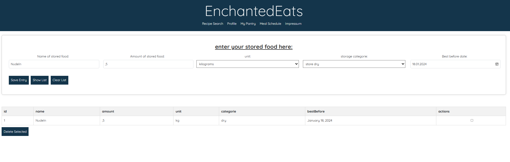
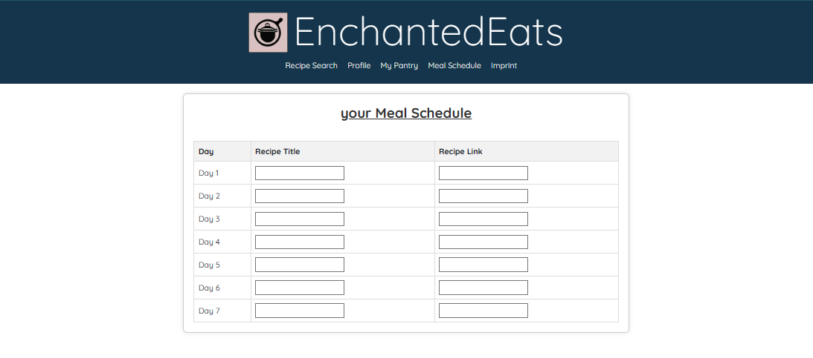

# EnchantedEats
 Webapplication for searching recipes as a project for the “Software Technology Project” module at the Berlin University of Technology (BHT).

 Welcome to the future of cooking and dining - discover EnchantedEats, your revolutionary kitchen assistant! In our hectic world, 
 EnchantedEats offers a unique solution that transforms your refrigerator into a source of inspiration. Imagine this: You open your 
 fridge and instead of uncertainty, you are greeted by a world full of tailor-made recipe ideas, perfectly suited to what you already 
 have at home. With just a few additional ingredients, an entire universe of new taste experiences unfolds.

 EnchantedEats understands you and your individual needs. Whether it's allergies, special diets, or personal taste preferences - 
 our app takes all of this into account and provides custom-made recipes that not only fit but also inspire. For the health-conscious among us, 
 EnchantedEats offers i ntelligent nutritional adjustment based on your activities and needs. You receive recipe suggestions that perfectly 
 complement your nutrient and energy requirements, complete with calorie counting and nutritional information.

 But that's not all. EnchantedEats is committed to sustainability and actively fights food waste by encouraging you to use existing food 
 completely and creatively. With EnchantedEats by your side, healthy, delicious food tailored to your desires is just a fingertip away. 
 Experience what it's like to always have a personal chef on hand - welcome to EnchantedEats, your partner for a smarter, healthier kitchen!

## functions
 - Recipe search by entering ingredients
 - Filtering function
 - Random recipe search
 - Create and save a profile
 - Pantries (store food items...)

Future Feature
 in prepation -> Menu Schedule

## installation & start
****************************************************************************************************
1. Clone or download the project source code to your local machine with
   `git clone https://github.com/saskiamellies/rezept-softwaretchnik.git`
3. Install dependencies. This can be done using a package manager such as npm (Node Package Manager) or yarn.
   (`npm install` or `yarn install`).
4. Run the development server with `npm start` or `yarn start`.
5. Access the project in your web browser by navigating to http://localhost:3000 or another specified URL.
****************************************************************************************************

### Installation 
****************************************************************************************************
*** - clone repo with `git clone https://github.com/saskiamellies/rezept-softwaretchnik.git`     ***
*** - install Node and npm                                                                       ***
*** - install dependencies:                                                                      ***
***   `npm install --save react-router-dom'                                                      ***
***   `npm install random-avatar-generator'                                                      ***
****************************************************************************************************

### Start
 - start development server with 'npm start'
   application runs on 'http://127.0.0.1:3000'

### Tests
 - run tests with 'npm test'

## technologies
Front End:
 - React
 - Bootstrap
 - JavaScript
 - HTML
 - CSS

Back-End:
 - Vercel ???

API:
 - https://www.themealdb.com/api.php

## Deployment
There is `test+deploydeploy.yaml` file for workflow: After push into master, it will be automatically tested and deployed to Vercel once tests are successful. 

Website: https://rezept-softwaretchnik-umber.vercel.app/

## Monitoring (Sentry)
default integraton provide from Sentry, which will be notified only for production environment

## License
see [MIT License](LICENSE) 

## Documentation
see [IT-Konzept](documentation/Index.md)

## Contact
 - André Schlichting     Mail: s69575@bht-berlin.de
 - Daniel Kunst          Mail: s81797@bht-berlin.de
 - Christoph Rudolph     Mail: s82089@bht-berlin.de
 - Theo Prill            Mail: s82168@bht-berlin.de
 - Jan Gruner            Mail: s81694@bht-berlin.de
 - Saskia-Maria Mellies  Mail: s54177@bht-berlin.de

