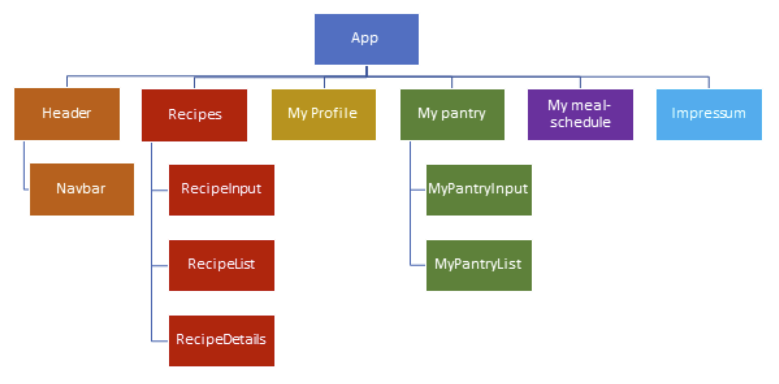

## **Technologien**
<!-- blank line -->
- **React**: Eine JavaScript-Bibliothek zur Erstellung von Benutzeroberflächen.
- **JavaScript**: Die Programmiersprache, die für die Umsetzung logischer Funktionen und Interaktionen verwendet wird.
- **CSS**: Die Stylesheet-Sprache, die für das Styling und Design der Benutzeroberfläche genutzt wird.
- **Bootstrap**: Ein Frontend-Framework für die Entwicklung responsiver und stilvoller Websites.
- **Jest**: Ein JavaScript-Testframework zur Durchführung von Einheits- und Integrationstests.
- **MealDB API**: Eine externe API (https://www.themealdb.com/api.php), die zur Abfrage von informationsbezogenen Daten verwendet wird.
- **GitHub Actions**: Ein CI/CD-Tool, das in GitHub integriert ist, um Workflows zu automatisieren.
- **Vercel**: Eine Plattform für serverloses Deployment, die für das Hosting und die Bereitstellung dieses Projekts verwendet wird.
- **Sentry.io**: Ein Überwachungstool zur Fehlerverfolgung und Leistungsüberwachung.

## **Anwendungsplattform**
<!-- blank line -->
**Primäre Plattform:** Web-Anwendung
<!-- blank line -->
**Geplante Erweiterungen:** Mobile Version der Website, Entwicklung einer Applikation für iOS- und Android-Geräte
<!-- blank line -->
## **Komponenten**
Die nachfolgende Grafik soll als Schaubild einen Überblick über unser Vorhaben geben:
<!-- blank line -->

## **Datenbankintegration**
<!-- blank line -->
Derzeitige Datenintegration aus "TheMealDB.com" 
Die genutzte API verwendet nur die englische Sprache
<!-- blank line -->
## **Websitehosting**
<!-- blank line -->
derzeitige Development - Nutzung über Vercel
https://rezept-softwaretchnik-umber.vercel.app/
<!-- blank line -->
Die Anwendung soll auf einem geeigneten Server gehostet werden, sobald das MVP finalisiert worden ist.
<!-- blank line -->
Anforderungen an den Server sind noch zu definieren, sollten aber Skalierbarkeit, Sicherheit und gewissen Verfügbarkeit berücksichtigen.
<!-- blank line -->
## **Bandbreite (Carrier, QoS)**
<!-- blank line -->
Bei der Verwendung von Youtube in HD Qualität ist eine Bandbreite von max. 15Mbit/s notwendig.
Ansonsten reichen 5.0 Mbit/s aus um Videos ruckelfrei sehen zu können.
