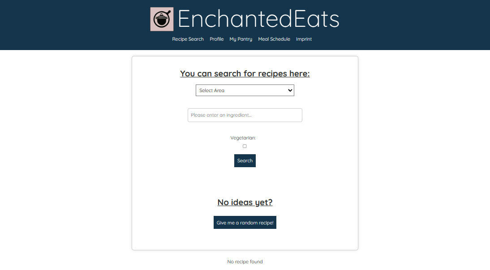
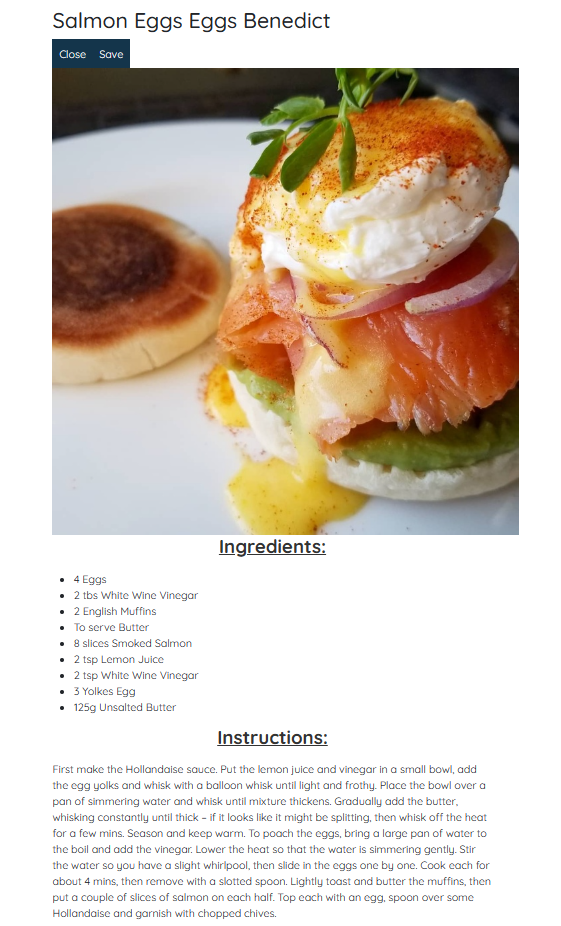

## Systemvoraussetzungen
Nutzung über alle gängigen Browsers wie Egde, Crome, Firefox, Safari ...

## Nutzer- und Berechtigungskonzept
Noch in Arbeit für Login- und MyProfile

## Übersicht des User Interface (UI): 
+ Startseite mit Suchfeld zentral platziert.
+ Checkboxes für Filteroptionen wie "Vegetarian" und eine Dropdown-Liste zur Auswahl der Küchenregion.
+ "Give me a random recipe!"-Button für Zufallsrezepte.
+ Eine Rezeptkarte mit einem Foto, Titel und Optionen zum Schließen und Speichern.
+ Profilerstellungsbereich mit Formularfeldern für Bild, Namen, Benutzernamen, Lieblingsgericht, Allergien, Ernährungsbeschränkungen, E-Mail und einer eindeutigen ID.

## Design-Prinzipien: 
+ Schlichtes und modernes Design mit einer einheitlichen Farbpalette.
+ Ausreichender Weißraum um die Elemente, um eine klare Trennung und einfache Lesbarkeit zu gewährleisten.

## Farbschema und Typografie: 
+ Dominierende Blautöne im Header und Footer, Weiß als Hintergrund für den Inhaltsbereich.
+ Serifenlose Schriftart für Textinhalte, steht für Klarheit und Modernität.

## Navigationsstruktur: 
+ Im Weblayout befindet sich eine horizontale Menüleiste mit Links zu "Recipe Search", "Profile", "My Pantry", "Meal Schedule" und "Impressum" und einer Suchleiste
  zur Eingabe der Zutaten (aktuell ist nur eine Zutat möglich)
+ Klare visuelle Trennung der Menüleiste vom Inhalt durch Farbkontrast.

## Interaktionsdesign: 
+ Interaktive Elemente wie Buttons und Formularfelder sind klar erkennbar und nutzerfreundlich.
+ In der Suchleiste ist die Einfabe von Zutaten (in englisch) möglich
+ Drop Down Menues in MyPantry zur Auswahl von Gewicht und Essenskategorie

## Responsives Design: 
+ Die Gestaltung der Elemente lässt auf ein fließendes Layout schließen, das sich an unterschiedliche Bildschirmgrößen anpassen kann

## Zugänglichkeit (Accessibility): 
+ Große, klickbare Elemente und klare Beschriftungen für eine gute Zugänglichkeit.
+ derzeitig Keine Hilfsmittel für Nutzer mit Sehbehinderungen wie Alternativtexte oder ARIA-Labels verfügbar.

## UI-Komponentenbibliothek: 
+ Wiederverwendbare Komponenten wie Suchfelder, Buttons und Rezeptkarten sind im gesamten Interface konsistent integriert.

## Screenshots und Beispiele: 
Jeder Screenshot zeigt einen bestimmten Bereich der Webseite: Suche, Rezeptansicht, Profilerstellung und Vorratsverwaltung.

## Feedback- und Fehlermeldungen: 
+ Feedback kann über das Impressum gegeben werden - Kontaktendaten sind angegeben

## Internationalisierung und Lokalisierung: 
+ Die gesamte Webseite ist derzeitig nur in englischer Sprache verfügbar

## Richtlinien zur UI-Entwicklung: 
+ spezifische Richtlinien zur UI-Entwicklung definiert/ bekannt

## Versionierung und Updates: 
+ aktuell (noch) nicht implementiert

+ ## **Benutzeroberfläche Website**
<!-- blank line -->
Klare und intuitive Benutzeroberfläche, die eine einfache Navigation und Interaktion mit der Webseite ermöglicht.
<!-- blank line -->

## **Benutzeroberfläche APP**
<!-- blank line -->
Für die spätere mobile Version soll die Anwendung ein Design verwendet 
werden bzw., aufweisen, dass eine optimale Darstellung auf verschiedenen 
Geräten ermöglicht.

